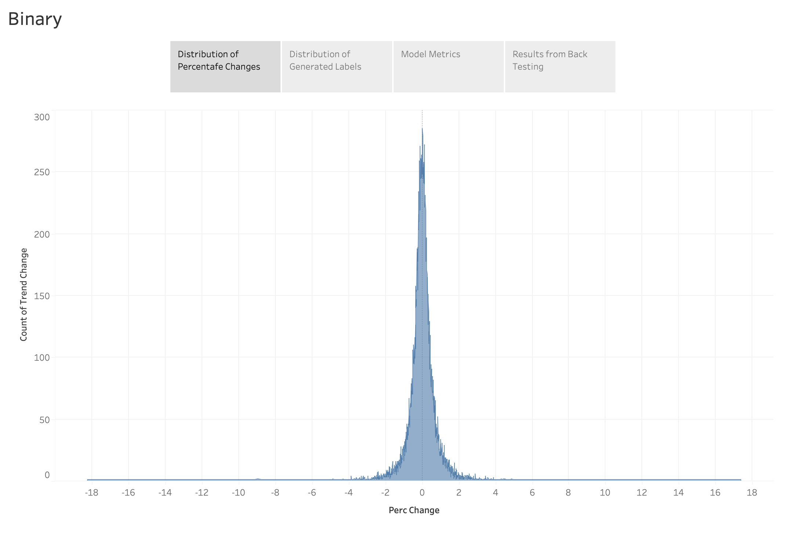
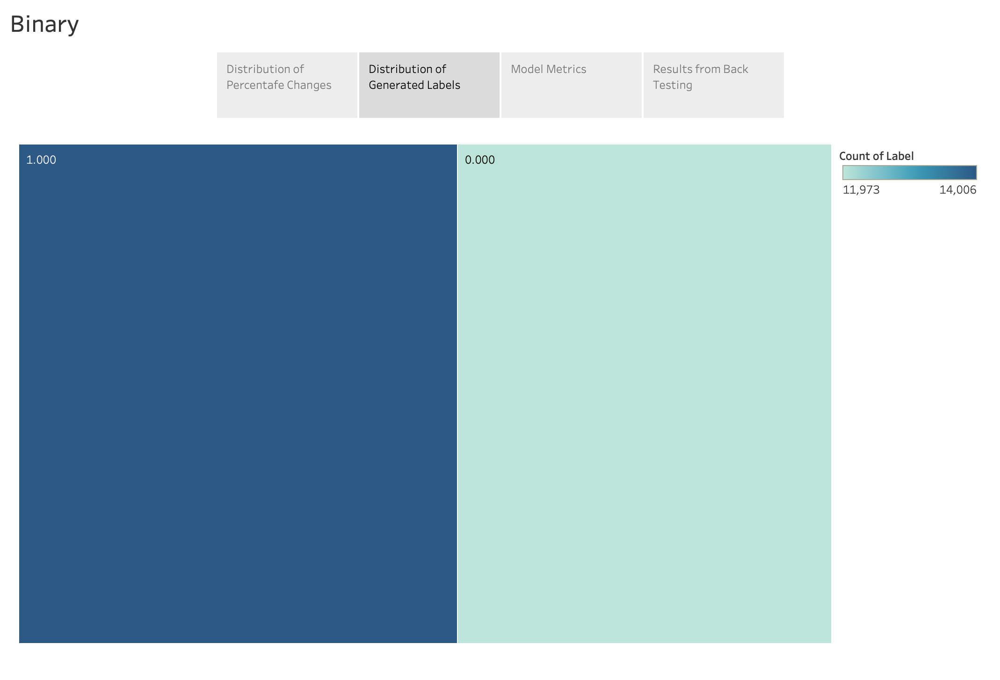
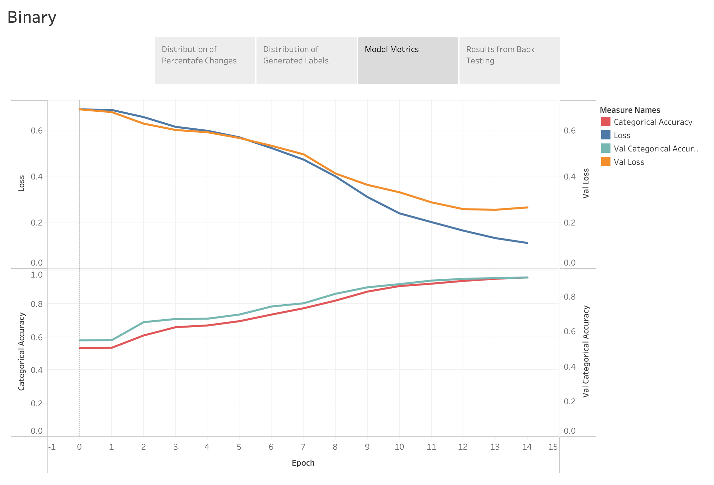
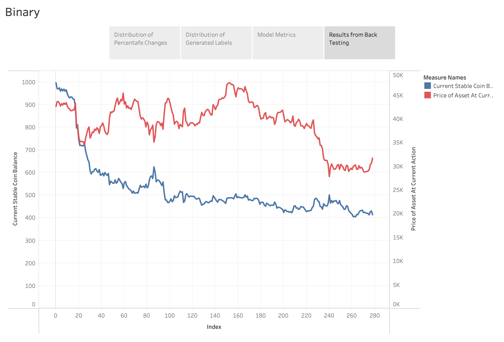
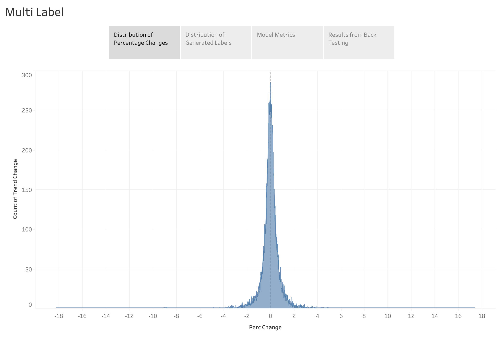
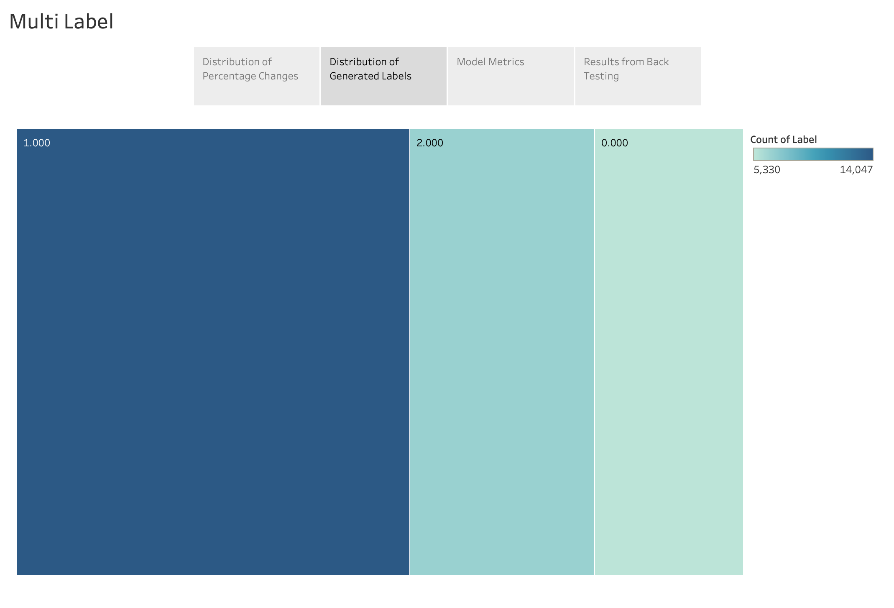
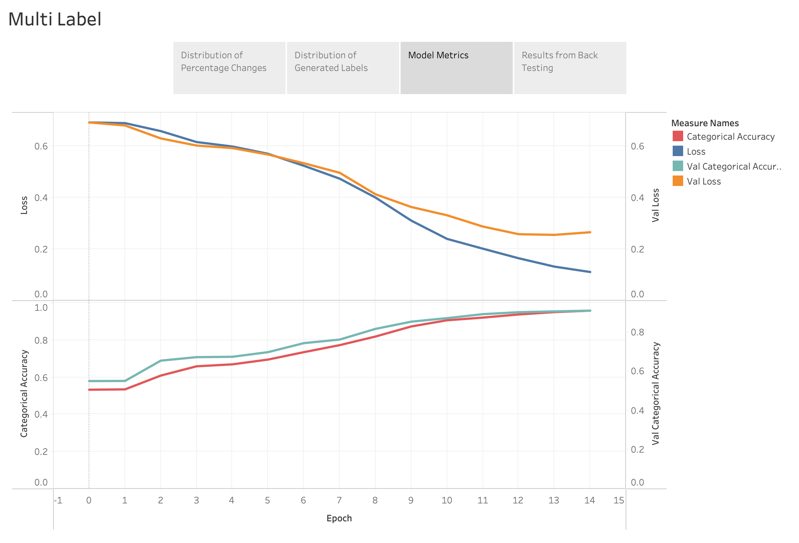
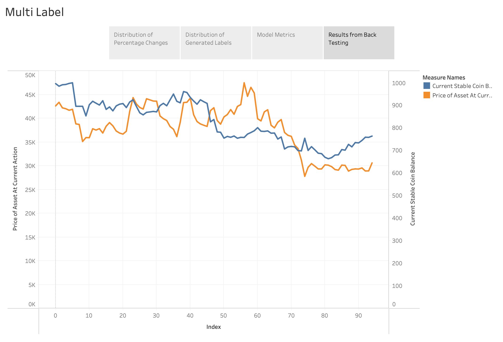

# MachineLearningPricePrediction
Price prediction for cryptocurrency using machine learning, reinforcement learning in plan

### TODO
- [x] Model 1 (BTCUSDT, historical terms 256, time intrval 1hr, prediction length 12hr)
    - [x] Exploratory Data Analysys
    - [x] Model Building
      - [x] Binary CNN1D
      - [x] Multi class CNN1D 
    - [x] Training
    - [x] Back Testing

## About
Price prediction by classification. I performed binary classification and multilabel classificaiton on cryptocurrency market data. I have used Convolutional Neural Network for classification in this public repository. I am doing further research and trying different types of models including Logistic Regression, LSTM, KNN, SVM, and Ensemble methods as part of a larger project. 

The back testing reveals that the models and strategy currently used here are not profitable. So, I am working on creating better strategies, models, and working on reinforcement learning to produce highly profitable system.  

## Possible Points of Upgrade
These you can find with in the codes as comments. These are points of upgrade I imagined could better the program. This are suggestions, and also my focus as I improve this program.

## Visualizations
Visualizations for this project are made in Tableau because of the high quality visualizations Tableau creates. However, DataFrames are easily accessible from multiple points in the program so it is easy to plot any plot with Matplotlib or other methods.

The Tableau files along with the data are found in data/Model-1 Visualizations.twb or see the interactive versuion in Table Public <a href="https://public.tableau.com/shared/8CT4DNX6R?:display_count=n&:origin=viz_share_link">here for Binary Classification </a> and <a href="https://public.tableau.com/views/CryptocurrencyPricePredictionModel-1Visualizations-MultiLabel/MultiLabel?:language=en-US&publish=yes&:display_count=n&:origin=viz_share_link">here for Multi label Classification</a>.

The non-interactive versions are given below for fast access

<strong>Binary Classification</strong>

This image shows the distribution of 1hr percentage change in the price of BitCoin for the training data, It has a normal distribution centered around zero (0%) and tails around two (2%) and negative two (-2%).

This image shows the ditribution of the labels for the training data. Given that the percentage change in 1hr is a normal distribution centered around 0%, the method I used to determine between the two labels is ~0% change as the division point, accordingly the distribution of the labels is mostly equal. (0 for down trend, 1 for up trend)

This image shows the progression of metrics as the model is fit with the training data. Validation loss starts diverging after epoch 13. The categorical accuracy and validation set categorical accuracy start converging around the same point.

This image shows the profit on back testing using the binary classification. The test was run on five months data (Jan 2022 - June 2022) on a single stratefy. The strategfy used was long/short for the prediction length (12 hours). While it is not in general profitable, profits are often observed in short positions (when the asset's price is falling) and losses are often observed on long positions (when the asset's price is rising). This is a very important visualization for the improvements on the system.

<strong>Multi label Classification</strong>

This image shows the distribution of 1hr percentage change in the price of BitCoin for the training data, It has a normal distribution centered around zero (0%) and tails around two (2%) and negative two (-2%). (same data as binary classification)

This image shows the ditribution of the labels for the training data. I used the range (-1%, 1%) to label the sideways trend. This creates a distibution of ~50% in the sideways trend and ~25% each for down and up trend. (0 for down trend, 1 for sideways trend, 2 for up trend)

This image shows the progression of metrics as the model is fit with the training data. Validation loss starts diverging after epoch 13. The categorical accuracy and validation set categorical accuracy start converging around the same point.

This image shows the profit on back testing using the multi label classification. The test was run on five months data (Jan 2022 - June 2022) on a single stratefy. The strategfy used was long/short for the prediction length (12 hours). While, like binary classification, it is not in general profitable, it is more profitable (less loss) than Binary classificaton. It is also less reactive to trends. The next steps in the improvement of this model would be increasing the number of data labeled as down and up trend (decreasing the range defined as sideways trend).

## Current/Future Progress
Currently, under this project, I am working on:
- sentiment analysis
- multi-model strategy
- high frequency trading strategy
